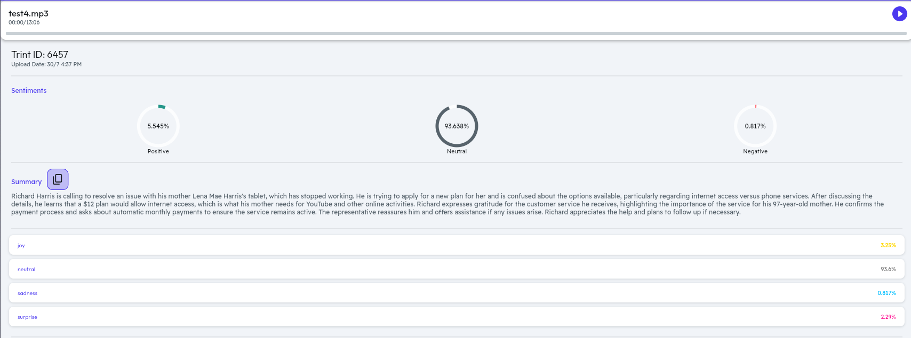
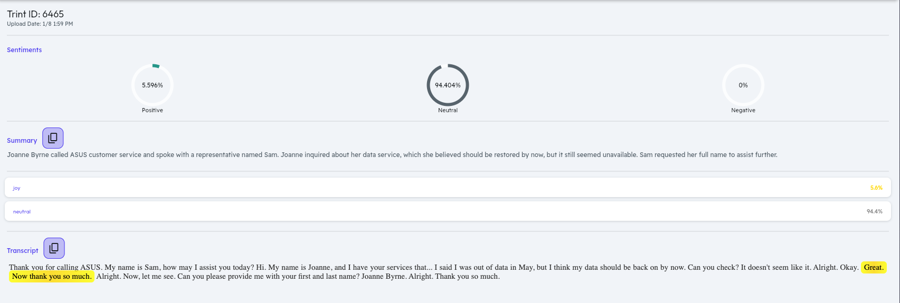

# TrintAI

## **Gain insights from audio files in minutes**
TrintAI is a powerful open source tool for converting speech into text. In addition to its transcription capabilities, it can generate summaries of the audio and detect sentiments and emotions.
Using TrintAI you can power your apps with cutting-edge speech recognition.

## Key Features
- **Speech-to-Text Transcription**: Converts audio files into accurate, readable text in real-time.
- **Summarization**: Provides concise summaries of long audio files or transcripts. This feature extracts the most important information and key points from the text, allowing you to quickly understand the main takeaways from meetings, calls, or any extended audio content.
- **Sentiment Analysis**: Detects emotions within the transcribed text.
- **Language Identification**: Detects the language spoken in the audio file and can transcribe in multiple languages.
- **Diarization**: Identify and distinguish between different speakers within an audio recording.


More to come...

📣 We're currently seeking community maintainers, so don't hesitate to get in touch if you're interested, check the  [contribution guidelines](CONTRIBUTING.md) 📣


## ⭐️ Give Us a Star! ⭐️

If you find this project useful or interesting, please consider giving it a star on GitHub! 🌟 Your support helps us continue to improve and maintain the project.

Just click the star button at the top of the repository page. Your feedback and support mean a lot to us. Thank you! 😊


## Enterprise transcription services
We believe in open source and we believe we can take TrintAI to the next level. Here we provide a list of the most popular speech-to-text paid services in the market that can be use for feature comparison.
- [AssemblyAI](https://www.assemblyai.com/)
- [Deepgram](https://deepgram.com/)
- [Gladia](https://gladia.io)
- [Google Cloud](https://cloud.google.com/speech-to-text)
- [Microsoft Azure](https://azure.microsoft.com/en-us/products/cognitive-services/speech-to-text)
- [RevAI](https://www.rev.ai/)
- [Whisper](https://openai.com/blog/introducing-chatgpt-and-whisper-apis)


## Installation

### Prerequisites
- [Python >=3.11](https://www.python.org/)
- [ffmpeg](https://www.ffmpeg.org/)
- [pyAudioAnalysis](https://github.com/tyiannak/pyAudioAnalysis)
- [whisper.cpp](https://github.com/ggerganov/whisper.cpp)
- [llamafile](https://github.com/Mozilla-Ocho/llamafile)
- [Mozilla/whisperfile](https://huggingface.co/Mozilla/whisperfile)
- [Mutagen](https://github.com/quodlibet/mutagen)
- [FastAPI](https://fastapi.tiangolo.com/)
- [openai](https://platform.openai.com/docs/libraries/python-library) (📣 only use for the **summarization** feature)


#### Hugginface Models
- [j-hartmann/emotion-english-distilroberta-base](https://huggingface.co/j-hartmann/emotion-english-distilroberta-base)
- [Systran/faster-whisper-large-v3](https://huggingface.co/Systran/faster-whisper-large-v3)


### Setup

1. Clone the repository:
```
git clone https://github.com/Trint-ai/TrintAI.git
```

2. Configure environment variables:
```
cp backend/.env.example backend/.env
```

3. Install python libraries:
```
cd backend
pip install -r requirements.txt
```

4. Run the application:
```
cd app
python main.py
```

### [Optionally] Run with Docker

1. Build the docker image:
```
docker build -t trintai .
```
2. Run trintAi with Docker:
```
docker run -p 8000:8000 -t trintai
```

### Usage
1. Send a request to TrintAI to process an audio file:
```
curl --header "Content-Type: application/json" \
        --request POST \
        --data '{"file":"https://mycustomdomain/audio.mp3"}' \
        http://localhost:8000/api
```

2. TrintAI return a JSON object with the following structure:
```
{
    'summary': str,
    'transcript': list
}
```
Where `transcript` structure is:
```
{   
    'timestamps':
        {
            'from': str(timestamp)
            'to': str(timestamp)
        },
    'offsets':
        {
            'from': int
            'to': int
        }
     'text': str,
     'speaker': str,
     'emotion': str,
     'emotion_score': int
}
```

Example:
```
{
    "summary": {
        "summary": "Joanne Burns called ILTECA Telecom for assistance regarding her data service, which she believed should have been restored by now. Sam, the representative, asked for her name to check the status of her data."
    },
    "transcript": [
        {
            "timestamps": {
                "from": "00:00:00,000",
                "to": "00:00:03,120"
            },
            "offsets": {
                "from": 0,
                "to": 3120
            },
            "text": "Thank you for calling ILTECA Telecom.",
            "speaker": "1",
            "emotion": "joy",
            "emotion_score": 0.5524019002914429
        },
        {
            "timestamps": {
                "from": "00:00:03,120",
                "to": "00:00:04,080"
            },
            "offsets": {
                "from": 3120,
                "to": 4080
            },
            "text": "My name is Sam.",
            "speaker": "1",
            "emotion": "neutral",
            "emotion_score": 0.6922041177749634
        },
        {
            "timestamps": {
                "from": "00:00:04,080",
                "to": "00:00:05,260"
            },
            "offsets": {
                "from": 4080,
                "to": 5260
            },
            "text": "How may I assist you today?",
            "speaker": "1",
            "emotion": "neutral",
            "emotion_score": 0.43952763080596924
        },
        {
            "timestamps": {
                "from": "00:00:05,260",
                "to": "00:00:08,780"
            },
            "offsets": {
                "from": 5260,
                "to": 8780
            },
            "text": "Hi. My name is Joanne.",
            "speaker": "0",
            "emotion": "neutral",
            "emotion_score": 0.8426525592803955
        },
        {
            "timestamps": {
                "from": "00:00:08,780",
                "to": "00:00:14,840"
            },
            "offsets": {
                "from": 8780,
                "to": 14840
            },
            "text": "And I have your services that -- I said I was out of data in May.",
            "speaker": "0",
            "emotion": "neutral",
            "emotion_score": 0.5988990068435669
        },
        {
            "timestamps": {
                "from": "00:00:14,840",
                "to": "00:00:18,320"
            },
            "offsets": {
                "from": 14840,
                "to": 18320
            },
            "text": "But I think my data should be back on by now.",
            "speaker": "0",
            "emotion": "neutral",
            "emotion_score": 0.9454419016838074
        },
        {
            "timestamps": {
                "from": "00:00:18,320",
                "to": "00:00:19,220"
            },
            "offsets": {
                "from": 18320,
                "to": 19220
            },
            "text": "Can you check?",
            "speaker": "0",
            "emotion": "neutral",
            "emotion_score": 0.7124136090278625
        },
        {
            "timestamps": {
                "from": "00:00:19,220",
                "to": "00:00:20,540"
            },
            "offsets": {
                "from": 19220,
                "to": 20540
            },
            "text": "It doesn't seem like it.",
            "speaker": "0",
            "emotion": "surprise",
            "emotion_score": 0.5951151847839355
        },
        {
            "timestamps": {
                "from": "00:00:20,540",
                "to": "00:00:25,320"
            },
            "offsets": {
                "from": 20540,
                "to": 25320
            },
            "text": "All right.",
            "speaker": "1",
            "emotion": "neutral",
            "emotion_score": 0.6785580515861511
        },
        {
            "timestamps": {
                "from": "00:00:25,320",
                "to": "00:00:25,940"
            },
            "offsets": {
                "from": 25320,
                "to": 25940
            },
            "text": "Okay. Great.",
            "speaker": "1",
            "emotion": "joy",
            "emotion_score": 0.9347952008247375
        },
        {
            "timestamps": {
                "from": "00:00:25,940",
                "to": "00:00:27,900"
            },
            "offsets": {
                "from": 25940,
                "to": 27900
            },
            "text": "Now, thank you so much.",
            "speaker": "1",
            "emotion": "joy",
            "emotion_score": 0.7642761468887329
        },
        {
            "timestamps": {
                "from": "00:00:28,960",
                "to": "00:00:32,720"
            },
            "offsets": {
                "from": 28960,
                "to": 32720
            },
            "text": "All right.",
            "speaker": "0",
            "emotion": "neutral",
            "emotion_score": 0.6785580515861511
        },
        {
            "timestamps": {
                "from": "00:00:32,720",
                "to": "00:00:34,680"
            },
            "offsets": {
                "from": 32720,
                "to": 34680
            },
            "text": "Now, let me see.",
            "speaker": "1",
            "emotion": "neutral",
            "emotion_score": 0.44418302178382874
        },
        {
            "timestamps": {
                "from": "00:00:34,680",
                "to": "00:00:38,980"
            },
            "offsets": {
                "from": 34680,
                "to": 38980
            },
            "text": "Can you please provide me with your first and last name?",
            "speaker": "1",
            "emotion": "neutral",
            "emotion_score": 0.8994667530059814
        },
        {
            "timestamps": {
                "from": "00:00:38,980",
                "to": "00:00:42,140"
            },
            "offsets": {
                "from": 38980,
                "to": 42140
            },
            "text": "Joanne Burns.",
            "speaker": "0",
            "emotion": "neutral",
            "emotion_score": 0.7366818785667419
        },
        {
            "timestamps": {
                "from": "00:00:42,140",
                "to": "00:00:44,580"
            },
            "offsets": {
                "from": 42140,
                "to": 44580
            },
            "text": "All right.",
            "speaker": "1",
            "emotion": "neutral",
            "emotion_score": 0.6785580515861511
        }
    ]
}
```

## What you can do with TrintAI?
Use TrintAI speech-to-text application to analyze audio files from call centers, meetings, and calls. Gain insights from conversations, improve customer interactions, and streamline decision-making with accurate transcriptions.






## Looking for a custom solution?
Need a custom solution? [Reach out to us!](mailto:albertollamaso@gmail.com)
